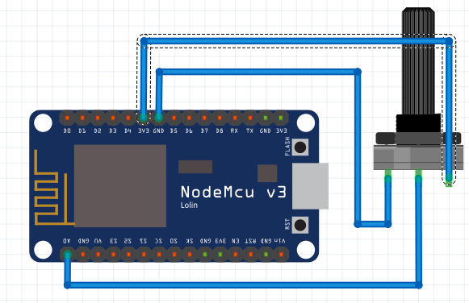
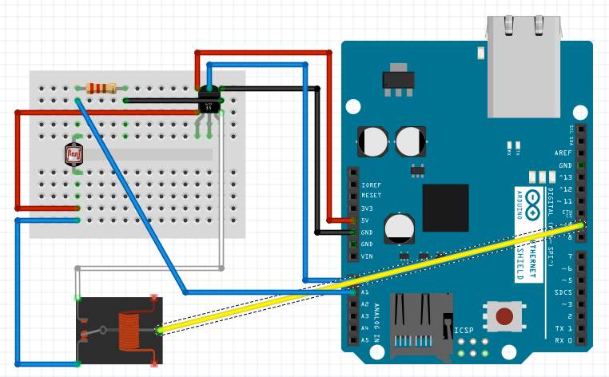
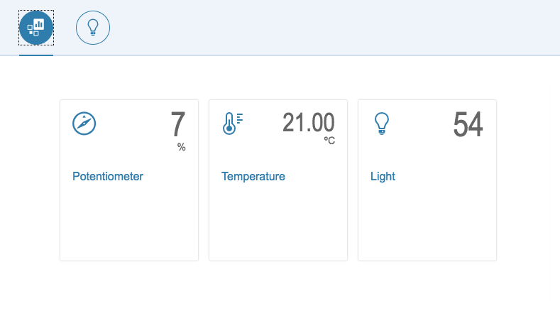

Playing with Iot, MQTT, Arduino and Rasperry Pi. Building a dashboard with openUI5
======

I've been playing with MQTT in previous posts. Today I want to build a simple dashboard. Basically because I've got a 3.5inch display for my Raspberry Py and I want to use it. The idea is set up my Rasperry Pi as a web kiosk and display the MQTT variables in real time using websockets. Let's start.

Set up Raspberry Pi as a web kiosk is pretty straightforward. You only need to follow instructions detailed here (https://medium.com/stories-from-upstatement/how-to-build-a-web-kiosk-with-a-raspberry-pi-some-cables-and-a-tv-3dc2724acaa1). Now will prepare the mqtt inputs. Today we're going to reuse one example of previous post. A potentiometer controlled by a nodemcu microcontroller connected to our mqtt server via Wifi.



We also will build another circuit using a Arduino board and a ethernet Shield. 



With this circuit we'll register the temperature (using a LM35 temperature sensor), a photo resistor (CDS) to show the light level and a relay to switch on/off a light bulb. The Idea of the circuit is emit the temperature and light level to mosquitto mqtt server and listen to switch status form mqtt server to fire the relay. That's the arduino code

```c
#include <SPI.h>
#include <Ethernet.h>
#include <PubSubClient.h>

const int photocellPin = 1;
const int tempPin = 0;
const int relayPin = 9;
bool lightStatus = false;

const byte mac[] = { 0xDE, 0xAD, 0xBE, 0xEF, 0xFE, 0xED };

// mqtt configuration
const char* mqttServer = "192.168.1.104";
const int mqttPort = 1883;
const String topicLightChange = "sensors/arduino/light/change";
const String topicLightStatus = "sensors/arduino/light/status";
const String topicTemp = "sensors/arduino/temperature/room1";
const String topicLight = "sensors/arduino/light/room1";
const char* clientName = "com.gonzalo123.arduino";

EthernetClient ethClient;
PubSubClient client(ethClient);

void mqttReConnect() {
  while (!client.connected()) {
    Serial.print("Attempting MQTT connection...");
    if (client.connect(clientName)) {
      Serial.println("connected");
      client.subscribe(topicLightChange.c_str());
    } else {
      Serial.print("failed, rc=");
      Serial.print(client.state());
      Serial.println(" try again in 5 seconds");
      delay(5000);
    }
  }
}

void mqttEmit(String topic, String value) {
  if (client.publish((char*) topic.c_str(), (char*) value.c_str())) {
    //Serial.print("Publish ok (topic: ");
    //Serial.print(topic);
    //Serial.print(", value: ");
    //Serial.print(value);
    //Serial.println(")");
  } else {
    Serial.println("Publish failed");
  }
}

void callback(char* topic, byte* payload, unsigned int length) {
  Serial.print("Message arrived [");
  Serial.print(topic);
  Serial.print("] payload: ");
  String data;
  for (int i = 0; i < length; i++) {
    data += (char)payload[i];
  }

  if (strcmp(topic, topicLightChange.c_str()) == 0) {
    lightStatus = (data == "1") ? true : false;
    Serial.print(data);
  }
  
  Serial.println("");
}

void setup()
{
  Serial.begin(9600);
  pinMode(relayPin, OUTPUT);
  digitalWrite(relayPin, LOW);
  
  client.setServer(mqttServer, mqttPort);
  client.setCallback(callback);
  if (Ethernet.begin(mac) == 0) {
    Serial.println("Failed to configure Ethernet using DHCP");
  }

  delay(1500);
}

void loop()
{
  if (!client.connected()) {
    mqttReConnect();
  }

  client.loop();

  if (lightStatus == 1) {
    digitalWrite(relayPin, HIGH);
  } else {
    digitalWrite(relayPin, LOW);
  }
  mqttEmit(topicLightStatus, lightStatus ? "1" : "0");
  mqttEmit(topicLight, (String) analogRead(photocellPin));
  mqttEmit(topicTemp, (String) ((5.0 * analogRead(tempPin) * 100.0) / 1024.0));

  delay(500);
}
```

Now we're going to work with dashboard. This days I'm working with OpenUI5 within various projects and because of that we'll use this library to build the dashboard. we'll build something like this:




Basically it's a view
```xml
<mvc:View
        controllerName="gonzalo123.controller.Controller"
        height="100%"
        width="100%"
        xmlns="sap.m"
        xmlns:mvc="sap.ui.core.mvc"
        xmlns:app="http://schemas.sap.com/sapui5/extension/sap.ui.core.CustomData/1"
>
    <IconTabBar expandable="false"
                stretchContentHeight="true"
                class="sapUiResponsiveContentPadding">
        <items>
            <IconTabFilter icon="sap-icon://bbyd-dashboard">
                <TileContainer>
                    <StandardTile
                            icon="sap-icon://explorer"
                            number="{/potentiometer}"
                            numberUnit="%"
                            title="{i18n>potentiometer}"/>
                    <StandardTile
                            icon="sap-icon://temperature"
                            number="{/temperature}"
                            numberUnit="ºC"
                            title="{i18n>temperature}"/>
                    <StandardTile
                            icon="sap-icon://lightbulb"
                            number="{/light/level}"
                            title="{i18n>light}"/>
                </TileContainer>
            </IconTabFilter>
            <IconTabFilter icon="sap-icon://lightbulb">
                <Page showHeader="false"
                      enableScrolling="true">
                    <List>
                        <InputListItem label="{i18n>light}">
                            <Switch state="{/light/status}"
                                    change="onStatusChange"/>
                        </InputListItem>
                    </List>
                </Page>
            </IconTabFilter>
        </items>
    </IconTabBar>
</mvc:View>
```

And a controller:
```js
sap.ui.define([
        'jquery.sap.global',
        'sap/ui/core/mvc/Controller',
        'sap/ui/model/json/JSONModel',
        "sap/ui/model/resource/ResourceModel",
        'gonzalo123/model/io'
    ],

    function (jQuery, Controller, JSONModel, ResourceModel, io) {
        "use strict";

        io.connect("//192.168.1.104:3000/");

        return Controller.extend("gonzalo123.controller.Controller", {
            model: new JSONModel({
                light: {
                    status: false,
                    level: undefined
                },
                potentiometer: undefined,
                temperature: undefined
            }),

            onInit: function () {
                var model = this.model;
                io.on('mqtt', function (data) {
                    switch (data.topic) {
                        case 'sensors/arduino/temperature/room1':
                            model.setProperty("/temperature", data.payload);
                            break;
                        case 'sensors/arduino/light/room1':
                            model.setProperty("/light/level", data.payload);
                            break;
                        case 'sensors/nodemcu/potentiometer/room1':
                            model.setProperty("/potentiometer", data.payload);
                            break;
                        case 'sensors/arduino/light/status':
                            model.setProperty("/light/status", data.payload == "1");
                            break;
                    }
                });

                this.getView().setModel(this.model);

                var i18nModel = new ResourceModel({
                    bundleName: "gonzalo123.i18n.i18n"
                });
                this.getView().setModel(i18nModel, "i18n");
            },

            onStatusChange: function (oEvent) {
                var status = this.getView().getModel().oData.light.status
                console.log("onStatusChange", status);
                io.emit('mqtt', {
                    topic: 'sensors/arduino/light/change',
                    payload: (status ? "1" : "0")
                });
            },

            onColorChange: function (oEvent) {
                var color = oEvent.getSource().data("color");
                var value = this.getView().getModel().oData.light[color];
                console.log(color, value);
                io.emit('mqtt', {
                    topic: 'sensors/arduino/light/' + color + '/change',
                    payload: value
                });
            }
        });
    }
);
```

The real time part we need a gateway between websockets and mqtt data. We'll use socket.io. Here is the server:

```js
var mqtt = require('mqtt');
var mqttClient = mqtt.connect('mqtt://192.168.1.104');
var httpServer = require('http').createServer();
io = require('socket.io')(httpServer, {origins: '*:*'});

io.on('connection', function(client){
    client.on('mqtt', function(msg){
        console.log("ws", msg);
        mqttClient.publish(msg.topic, msg.payload.toString());
    })
});

mqttClient.on('connect', function () {
    mqttClient.subscribe('sensors/#');
});

mqttClient.on('message', function (topic, message) {
    console.log("mqtt", topic, message.toString());
    io.sockets.emit('mqtt', {
        topic: topic,
        payload: message.toString()
    });
});

httpServer.listen(3000, '0.0.0.0');
```

# Hardware:
* 1 Arduino Uno
* 1 NodeMCU (V3)
* 1 potentiometer
* 1 Servo (SG90)
* 1 Raspberry Pi 3
* 3.5inch Display Hat for Raspberry Pi
* LM35
* CDS
* pull down resistor

# Demo
[](https://www.youtube.com/watch?v=4cdecwQ74U4)